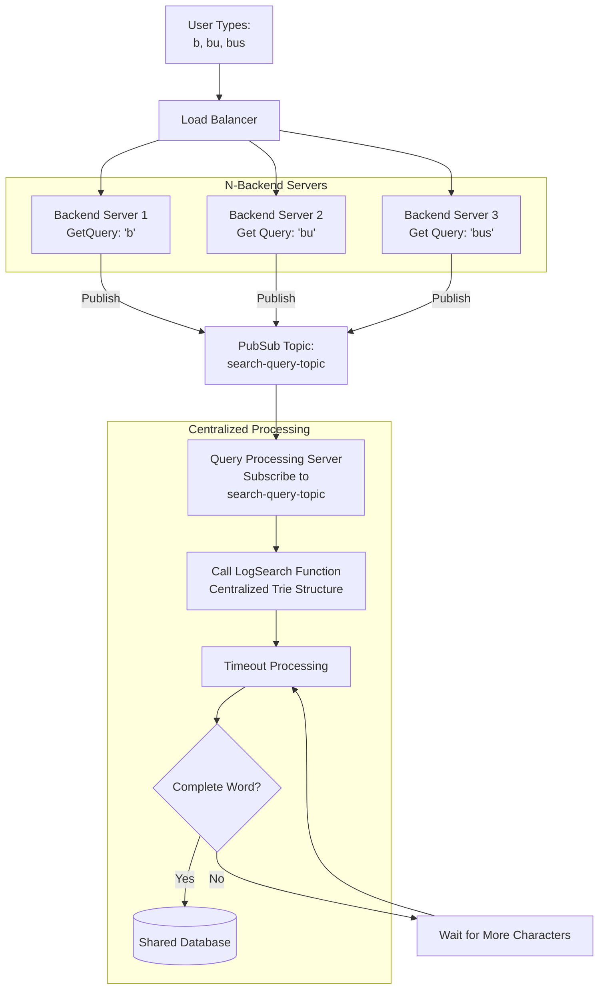

# LogSearch - Smart Search Deduplication

A Go implementation that intelligently deduplicates search queries by storing only the most complete form of words, even when users type incrementally.

## Problem Statement
As users search a topic on our site we want to log what they are searching so we can see what topics we should focus on next. Searches are done progressively so a search is run each time they enter a letter. We want to deduplicate these searches as best as we can and only store the most complete form of the word. So if a user searches for “B”, “Bu”, “Bus”, “Busi”, “Busin”, “Busine”, “Busines” then only Business is stored.
-  Log searches in a postgres or mysql database.
-  Deduplicate the searches so only the most complete version of the word that the user searched for is stored.
-  The user could be logged in or not logged in.
-  This will run on a multi-server environment.
-  Assume that searches come in through an api endpoint and that endpoint handler calls your logging function in a goroutine with the query, user id if logged in, and the request

When users search incrementally (e.g., "B" → "Bu" → "Bus" → "Business"), we want to:
1. Store only the most complete form of the word
2. Handle cases where users continue typing after a delay (the "5 hours later" problem)
3. Efficiently manage memory and storage

## Solution Overview

The implementation uses a **Trie data structure** combined with a **delayed storage mechanism**:

1. **Trie Structure**: Tracks all search prefixes in memory.
2. **Timeout-based Storage**: Words are stored to the database only after a timeout period, this is assuming the user will finish the typing of a search within a time-window.
3. **Dynamic Updates**: If a longer word comes in later time, it replaces shorter stored words.


## Files Structure

- `main.go`: Demo application showing database persistence and trie visualization
- `search_logger.go`: Main implementation - Core SearchLogger with timeout-based storage
- `postgres_mock.go`: MockPostgresDB simulation with detailed SQL logging
- `search_logger_test.go`: Unit test suite with testify assertions

### Demo In Action
Run this command to see the demo in action:
```
timeout 20s go run . 2>&1
```

Output:
```
=== Search Logger Demo ===
1. Creating initial logger and adding test data:

2. Creating new logger - load existing words from DB into trie:

3. Words loaded from database into tries:
2025/08/24 00:30:49 Mock PostgreSQL: SELECT word FROM searches ORDER BY word - returned 4 records
   - application
   - banana
   - band
   - apple

4. Adding new search terms - these will create new trie nodes [cats, dog, business]:

5. Stored searches after timeout: [cats dog apple application banana band business]

6. Testing word extension:
   Adding 'Businesses' (extends 'Business')

7. Final stored searches after extension:
2025/08/24 00:30:52 Mock PostgreSQL: SELECT word FROM searches ORDER BY word - returned 7 records
   - apple
   - application
   - banana
   - band
   - businesses
   - cats
   - dog

=== Demo Complete ===
```

## Handle the 'multi-server environment'

The problem stated that the API will call my LogSearch() in a goroutine. Considering that every character the user typed needs to be entered into a Trie, an in-memory data structure is ideal for such usecase to reduce number of database calls, trying to avoid a database call for every incoming queries.

However, there is a big catch. The problem statement says `This will run on a multi-server environment`, so, if the it is possible that Query=`b`, Query=`bu`, and Query=`bus` hit 3 different backend servers if the load balancer has no "session stickiness". In this case, the above solution will not work because the Trie structure is not be updated with all the searched words. 

Here is an updated structure to handle such situation as shown below. Such architecture also de-dupe the searches performed by multiple users. The PubSub can be done by any message broker (e.g., Kafka, RabbitMQ or Redis Pubsub).


