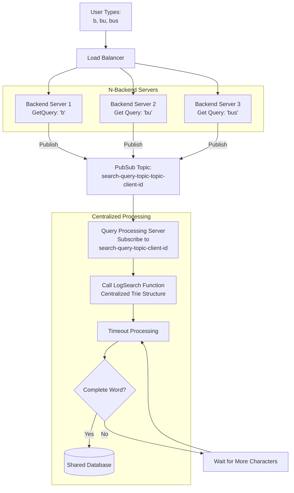

# LogSearch - Smart Search Deduplication

A Go implementation that intelligently deduplicates search queries by storing only the most complete form of words, even when users type incrementally.

## Problem Statement
As users search a topic on our site we want to log what they are searching so we can see what topics we should focus on next. Searches are done progressively so a search is run each time they enter a letter. We want to deduplicate these searches as best as we can and only store the most complete form of the word. So if a user searches for “B”, “Bu”, “Bus”, “Busi”, “Busin”, “Busine”, “Busines” then only Business is stored.
-  Log searches in a postgres or mysql database.
-  Deduplicate the searches so only the most complete version of the word that the user searched for is stored.
-  The user could be logged in or not logged in.
-  This will run on a multi-server environment.
-  Assume that searches come in through an api endpoint and that endpoint handler calls your logging function in a goroutine with the query, user id if logged in, and the request

When users search incrementally (e.g., "B" → "Bu" → "Bus" → "Business"), we want to:
1. Store only the most complete form of the word
2. Handle cases where users continue typing after a delay (the "5 hours later" problem)
3. Efficiently manage memory and storage

## Solution Overview

### Version 1
Please see the implementation in folder `./logSearchTrie`.

The implementation uses a **Trie data structure** combined with a **delayed storage mechanism**:

1. **Trie Structure**: Tracks all search prefixes in memory.
2. **Timeout-based Storage**: Words are stored to the database only after a timeout period, this is assuming the user will finish the typing of a search within a time-window. This approach will help reduce the number of database calls.
3. **Dynamic Updates**: If a longer word comes in later time, it replaces shorter stored words into PostgreSQL.

## Files Structure

- `main.go`: Demo application showing the SearchLogger in action. Run it, you will see the logging and deduplication process.
- `search_logger.go`: Main implementation - Core SearchLogger with timeout-based storage.
- `postgres_mock.go`: MockPostgresDB simulation with detailed SQL logging.
- `search_logger_test.go`: Unit test suite with testify assertions.

### Demo In Action
Run this command to see the demo in action:
```
timeout 20s go run . 2>&1   # Run main demo program
go test -v                  # Run unit test
```

Output (shortened):
```
=== Search Logger Demo ===
1. Creating initial logger and adding test data:

2. Creating new logger - load existing words from DB into trie:

3. Words loaded from database into tries:
2025/08/24 00:30:49 Mock PostgreSQL: SELECT word FROM searches ORDER BY word - returned 4 records
   - application
   - banana
   - band
   - apple

4. Adding new search terms - these will create new trie nodes [cats, dog, business]:

5. Stored searches after timeout: [cats dog apple application banana band business]

6. Testing word extension:
   Adding 'Businesses' (extends 'Business')

7. Final stored searches after extension:
2025/08/24 00:30:52 Mock PostgreSQL: SELECT word FROM searches ORDER BY word - returned 7 records
   - apple
   - application
   - banana
   - band
   - businesses
   - cats
   - dog

=== Demo Complete ===
```

## Handle the 'multi-server environment'
The problem statement mentioned the HTTP API handler (`<hostUrl>/api/experts?Query=b&Limit=28&Verified=true`) will call my LogSearch() in a goroutine. Considering that every character the user typed needs to be entered into a Trie, an in-memory data structure is ideal for such usecase to reduce number of database calls, trying to avoid a database call for every incoming queries. The existing implementation will work if it is a single-server environment.

However, there is a big catch. The problem statement says `This will run on a multi-server environment`, so, if the it is possible that Query=`b`, Query=`bu`, and Query=`bus` hit 3 different backend servers if the load balancer has no "session stickiness" for the same client, in addition, multiple queries from different users on the different devices will need same deduplication layers as well. In this case, the above solution will not work because the Trie structure is not be updated with all the searched words. 

Thinking of the complexity of syncing a distributed cache is way too expensive and the order or the incoming words can't be guaranteed, we will choose the approach to employ a single-topic PubSub model per client (because it has to work for both logged-in and guest users) with the centralized caching and dedup processing design.

Here is an updated structure to handle such situation as shown below. Such architecture also de-dupe the searches performed by multiple users. The PubSub can be done by any message broker (e.g., Kafka, RabbitMQ, GCP Pubsub or Redis Pubsub), with `Redis pubsub` to be the preferred choice due to it's simplicity, the topic will be auto-created if it does not exist before publishing, and the subscriber of the pubsub can subscrbe to all topics with prefix `search-query-topic-*`:

```
PSUBSCRIBE search-query-topic-*
```

Note that the `search-query-topic-client-id` is unique per user session, when the <client-id> is:
- When user is logged in, clientID = `userId-sessionId`.
- When user is a guest, clientID = `guest-<random-id>`, the front-end code will generate it.



### End of Version 1

### Version 2
1. Logged user vs un-logged-in user
For logged-in user, the backend knows the userID because the request passed the authentication layer and the auth_token is available to use assuming the auth is token based; 
For un-logged in users, we can generate an ephemeral cookie with name 'anon_id' on the first visit, and for the follow-up api calls we will use the same anon_id. This can be done in the authentication/gateway layer, if in the itsio environment, normally it is in `ext-auth-session` service, `k8s kind: AuthorizationPolicy`, before it hits any backend service.

This way, we can distinguish logged-in users and different un-logged-in users.

2. I thought it was a cut off but now I know that sentence is not. To satisfy the requirement that "It should deduplicate per user so the searchLog function should factor in the user doing the search", in the database table we will have something like this:

----- db table user_search -----
 user_dentifier, search_word
 user_id,           busine
 anon_id,          business

So we are doing dedup per user.

3. Yes, now I have cleared up the hurdle to identify logged-in users and un-logged-in users, I am able to provide a solution "without holding everything in memory, deal with mutex locks, use a PubSub, or require the front-end to pass a session id". My original approach was trying to reduce the number of DB queries and avoid handling the distributed caching complexity. 

Now, I will need to rely on a db query to the postgresQL for each api call to do the dedup per user. Some considerations:
 query 'b', 'bu', 'bus' ... will come in-order from the user's input, but they may end up with hitting call db query 'bus'-> 'bu'-> 'b', it can totally happen in a distributed system. But our dedupe logic should still handle it. In the case of a db call order 'bus'-> 'bu'-> 'b' or In the case of 'b'-> 'bu'->'bus', it will still keep 'bus'.

I will code it up and get back to you. If you see any draw-back or want to suggest something more, please reply to me today. 
Otherwise I will just go ahead with the implementation. And I should finish by later today, no later than tmr noon time worst case.